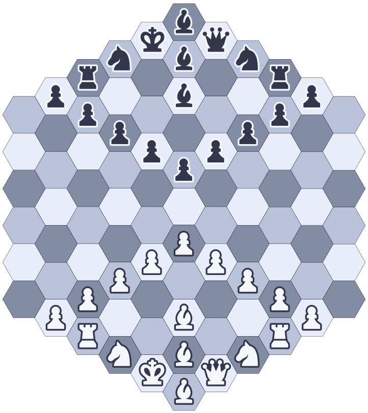

<!-- https://github.com/othneildrew/Best-README-Template -->

[![Forks][forks-shield]][forks-url]
[![Stargazers][stars-shield]][stars-url]
[![Issues][issues-shield]][issues-url]
[![MIT License][license-shield]][license-url]
[![LinkedIn][linkedin-shield]][linkedin-url]


<!-- PROJECT LOGO -->
<br />
<div align="center">
  <a href="https://hexagonalchess.zucchi.dev">
    
  </a>

<h3>Hexagonal Chess - Docker Compose</h3>

  <p>
    Immerse yourself in the strategic world of Gliński's variant chess with my project. The deployment is powered by Docker, showcasing my expertise in web development.
    <br />
    <br />
    <a href="https://hexagonalchess-api.zucchi.dev/swagger-ui/index.html">RESTful API doc</a>
    ·
    <a href="https://hexagonalchess.zucchi.dev">Live website</a>
    ·
    <a href="https://hexagonalchess-auth.zucchi.dev/realms/HexagonalChess/account/">Keycloak</a>
    ·
    <a href="https://github.com/sisimomo/hexagonalChess-docker-compose/issues">Report Bug</a>
    ·
    <a href="https://github.com/sisimomo/hexagonalChess-docker-compose/issues">Request Feature</a>
  </p>
</div>


<!-- TABLE OF CONTENTS -->
<details>
  <summary>Table of Contents</summary>
  <ol>
    <li>
      <a href="#about-the-project">About The Project</a>
      <ul>
        <li><a href="#built-with">Built With</a></li>
      </ul>
    </li>
    <li>
      <a href="#getting-started">Getting Started</a>
      <ul>
        <li><a href="#prerequisites">Prerequisites</a></li>
        <li><a href="#installation">Installation</a></li>
      </ul>
    </li>
    <li><a href="#usage">Usage</a></li>
    <li><a href="#roadmap">Roadmap</a></li>
    <li><a href="#license">License</a></li>
    <li><a href="#contact">Contact</a></li>
  </ol>
</details>


<!-- ABOUT THE PROJECT -->

## About The Project

As a passionate web developer, I constantly seek out intriguing challenges. Inspired by a
[YouTube video by C.G.P. Grey titled 'Can Chess, with Hexagons?'](https://youtu.be/bgR3yESAEVE), I
dove into the world of hexagonal chess and was immediately captivated by its unique complexity and
possibilities. This fascination drove me to create a digital version of the Gliński's variant,
blending my love for coding with my newfound interest for this chess variant.

<p align="right">(<a href="#readme-top">back to top</a>)</p>

### Built With

* [![Docker][Docker-shield]](https://www.docker.com/)
* [![MariaDB][MariaDB-shield]](https://mariadb.org/)
* [Keycloak](https://www.keycloak.org/)
* [HexagonalChess Frontend](https://github.com/sisimomo/hexagonalChess-frontend)
* [HexagonalChess Backend](https://github.com/sisimomo/hexagonalChess-backend)

<p align="right">(<a href="#readme-top">back to top</a>)</p>


<!-- GETTING STARTED -->

## Local development environment

To get a local copy up and running, follow these simple steps.

### Prerequisites

Before diving into the installation section, make sure your system meets the following
prerequisites:

- [Git](https://git-scm.com/)
- [Docker](https://www.docker.com/)
- [Docker Compose](https://docs.docker.com/compose/)
- [Java 17](https://www.java.com)
- [IntelliJ IDEA](https://www.jetbrains.com/idea/)
- [npm](https://www.npmjs.com/)
- [Angular CLI](https://cli.angular.io/)

### Installation

#### 1. Get Local Docker Compose Running

1.1. **Clone the Docker Compose Repository:**

Start by cloning the Docker Compose repository using the following command:

```sh
git clone https://github.com/sisimomo/hexagonalChess-docker-compose.git
```

1.2. **Navigate to the Local Folder:**

Move into the local folder within the cloned repository:

```sh
cd ./hexagonalChess-docker-compose/local
```

1.3. **Configure Environment Variables:**

Duplicate the `.env.sample` file and rename it to `.env`:

```sh
cp ./.env.sample  ./.env
```

Customize the variables in the `.env` file to your preferences.

1.4. **Initiate Docker Compose:**

Start docker containers using Docker Compose:

```sh
docker-compose up -d
```

#### 2. Get the Backend Running

2.1. **Clone the Backend Repository:**

Clone the backend repository using the following command:

```sh
git clone https://github.com/sisimomo/hexagonalChess-backend.git
```

2.2. **Open in IntelliJ:**

Open the cloned repository folder using IntelliJ IDEA.

2.3. **Update Environment Variables:**

Adjust the environment variables according to your `.env` modifications in the "Run/Debug
configuration" named "HexagonalChessApplication" located in the `.run` folder within the cloned
repository.

2.4. **Start the Application:**

Launch the application using the "Run/Debug configuration" named "HexagonalChessApplication" in
IntelliJ.

#### 3. Get the Frontend Running

3.1. **Clone the Frontend Repository:**

Clone the frontend repository using the following command:

```sh
 git clone https://github.com/sisimomo/hexagonalChess-frontend.git
```

3.2. **Navigate to the Frontend Folder:**

Change your working directory to the frontend folder:

```sh
cd ./hexagonalChess-frontend
```

3.3. **Install Dependencies:**

Install project dependencies using npm:

```sh
npm install
```

3.4. **Run the Project:**

Start the project using Angular CLI:

```sh
ng serve
```

#### 4. Enjoy!

Feel free to explore the code and provide suggestions for enhancement by creating feature requests
through new [GitHub issues][issues-url].

<p align="right">(<a href="#readme-top">back to top</a>)</p>


<!-- ROADMAP -->

## Roadmap

See the [open issues][issues-url] for a full list of
proposed features (and known issues).

<p align="right">(<a href="#readme-top">back to top</a>)</p>


<!-- LICENSE -->

## License

Distributed under the MIT License. See `LICENSE.txt` for more information.

<p align="right">(<a href="#readme-top">back to top</a>)</p>


<!-- CONTACT -->

## Contact

[![LinkedIn][linkedin-shield]][linkedin-url]

Project Urls:

* [Backend](https://hexagonalchess-api.zucchi.dev/)
* [Frontend](https://hexagonalchess.zucchi.dev/)
* [Identity provider](https://hexagonalchess-auth.zucchi.dev/realms/HexagonalChess/account/)

<p align="right">(<a href="#readme-top">back to top</a>)</p>


<!-- MARKDOWN LINKS -->
<!-- https://www.markdownguide.org/basic-syntax/#reference-style-links -->

[forks-shield]: https://img.shields.io/github/forks/sisimomo/hexagonalChess-docker-compose.svg?style=for-the-badge

[forks-url]: https://github.com/sisimomo/hexagonalChess-docker-compose/network/members

[stars-shield]: https://img.shields.io/github/stars/sisimomo/hexagonalChess-docker-compose.svg?style=for-the-badge

[stars-url]: https://github.com/sisimomo/hexagonalChess-docker-compose/stargazers

[issues-shield]: https://img.shields.io/github/issues/sisimomo/hexagonalChess-docker-compose.svg?style=for-the-badge

[issues-url]: https://github.com/sisimomo/hexagonalChess-docker-compose/issues

[license-shield]: https://img.shields.io/github/license/sisimomo/hexagonalChess-docker-compose.svg?style=for-the-badge

[license-url]: https://github.com/sisimomo/hexagonalChess-docker-compose/blob/master/LICENSE.txt

[linkedin-shield]: https://img.shields.io/badge/-LinkedIn-black.svg?style=for-the-badge&logo=linkedin&colorB=555

[linkedin-url]: https://linkedin.com/in/simon-vallieres-358555187

[Docker-shield]: https://img.shields.io/badge/docker-%230db7ed.svg?style=for-the-badge&logo=docker&logoColor=white

[MariaDB-shield]: https://img.shields.io/badge/MariaDB-003545?style=for-the-badge&logo=mariadb&logoColor=white
